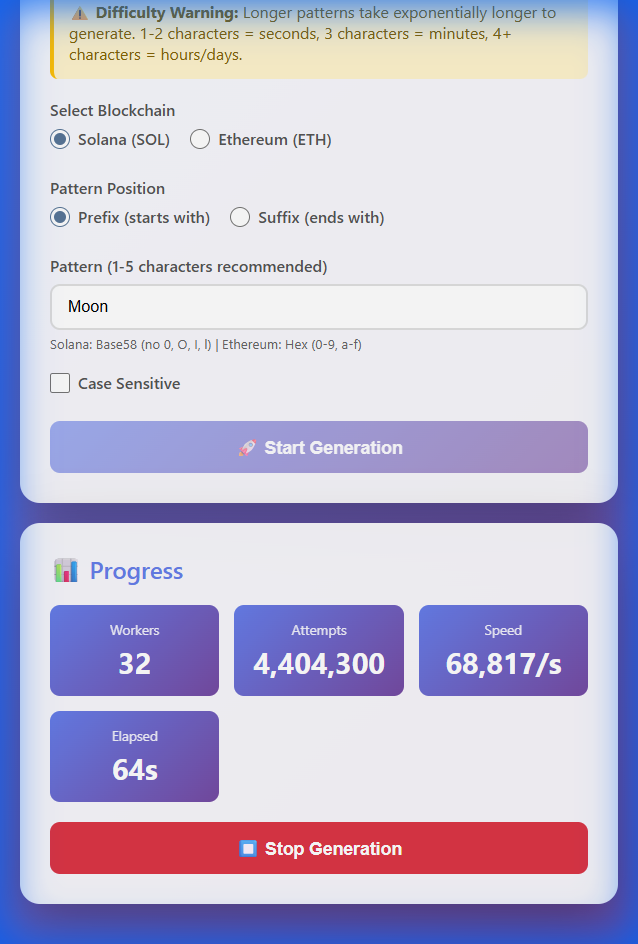

# Vanity Address Generator 🔑

Generate custom Solana and Ethereum addresses with your desired prefix or suffix patterns.

## 🌐 Live Demo

**Try it now**: [https://singledavinci.github.io/vanity-address-generator/](https://singledavinci.github.io/vanity-address-generator/)



*Generating custom addresses at ~68,000 attempts per second*

## 🚀 Features

- **Dual Blockchain Support**: Generate vanity addresses for both Solana (SOL) and Ethereum (ETH)
- **Flexible Patterns**: Choose prefix (starts with) or suffix (ends with) patterns
- **Case Sensitivity**: Optional case-sensitive matching
- **Real-time Progress**: Live stats showing attempts, speed, and elapsed time
- **Secure**: 100% client-side generation, no data sent to servers
- **Copy to Clipboard**: Easy one-click copying of addresses and keys

## 📖 How to Use

1. **Open the App**
   - Simply open `index.html` in any modern web browser
   - No installation or setup required!

2. **Configure Your Pattern**
   - Select blockchain: Solana or Ethereum
   - Choose position: Prefix or Suffix
   - Enter your desired pattern (1-5 characters recommended)
   - Toggle case sensitivity if needed

3. **Start Generation**
   - Click "Start Generation"
   - Watch the progress stats in real-time
   - The generator will stop automatically when a match is found

4. **Save Your Keys**
   - Copy your public address
   - **IMPORTANT**: Securely save your private key/seed phrase
   - Never share these with anyone!

## ⚙️ Pattern Guidelines

### Solana (Base58)
- **Valid characters**: `1-9, A-H, J-N, P-Z, a-k, m-z`
- **Excluded**: `0` (zero), `O` (capital o), `I` (capital i), `l` (lowercase L)
- **Example**: `Ab123`, `cool`, `5678`

### Ethereum (Hexadecimal)
- **Valid characters**: `0-9, a-f, A-F`
- **Example**: `0xABCD`, `1234`, `cafe`

## ⏱️ Time Estimates

Pattern difficulty increases exponentially:

| Length | Solana (Base58) | Ethereum (Hex) | Estimated Time |
|--------|-----------------|----------------|----------------|
| 1 char | 1 in 58         | 1 in 16        | Instant        |
| 2 char | 1 in 3,364      | 1 in 256       | Seconds        |
| 3 char | 1 in 195,112    | 1 in 4,096     | Minutes        |
| 4 char | 1 in 11,316,496 | 1 in 65,536    | Hours          |
| 5 char | 1 in 656M       | 1 in 1M        | Days           |

**Recommendation**: Stick to 1-3 characters for practical generation times.

## 🔒 Security Warnings

- ⚠️ **Never share your private key or seed phrase**
- ⚠️ Store keys securely offline (write down, use hardware wallet)
- ⚠️ Anyone with your private key can access your funds
- ⚠️ This tool generates keys client-side - no internet required after loading

## 🛠️ Technical Details

### Technologies Used
- **Solana**: `@solana/web3.js` - Official Solana JavaScript SDK
- **Ethereum**: `ethers.js` - Ethereum wallet library
- **Frontend**: Pure HTML/CSS/JavaScript (no framework needed)

### How It Works

1. **Brute Force Generation**: Creates random keypairs/wallets
2. **Pattern Matching**: Checks if address matches your pattern
3. **Multi-threaded**: Uses async/await for non-blocking generation
4. **Efficient**: Generates thousands of addresses per second

### Algorithm
```javascript
1. Generate random keypair
2. Extract public address
3. Check if matches pattern (prefix/suffix)
4. If match → display result
5. If no match → repeat from step 1
```

## 📊 Performance

Typical generation speeds (modern hardware):
- **Solana**: 2,000-5,000 addresses/sec
- **Ethereum**: 1,000-3,000 addresses/sec

Speed varies based on:
- CPU performance
- Browser (Chrome/Edge typically fastest)
- Background processes

## 🎯 Example Use Cases

- **Branding**: Addresses starting with your project name
- **Memorability**: Easy-to-remember patterns like `111`, `AAA`
- **Aesthetics**: Cool-looking addresses for social media
- **Organization**: Different prefixes for different purposes

## ⚠️ Limitations

- **No GPU acceleration**: Uses CPU only (browser limitation)
- **Single-threaded**: Can't use Web Workers due to crypto library constraints
- **Long patterns impractical**: 5+ characters may take days/weeks

## 🆘 Troubleshooting

**"Invalid pattern" error**
- Check you're using correct character set for the blockchain
- Solana: No 0, O, I, l
- Ethereum: Only 0-9, a-f

**Generation too slow**
- Try shorter pattern (reduce by 1 character)
- Use case-insensitive matching
- Close other browser tabs/apps

**Libraries not loading**
- Check internet connection (needed for CDN libraries)
- Try refreshing the page
- Use a different browser

## 📝 License

MIT License - Use freely and responsibly

## ⚡ Pro Tips

1. **Start small**: Test with 1-2 character patterns first
2. **Case insensitive**: Much faster to generate
3. **Monitor speed**: If speed < 100/s, pattern may be too long
4. **Backup immediately**: Save private keys right away
5. **Test addresses**: Send small amount first to verify

---

**Made with ❤️ for the blockchain community**

Remember: With great keys comes great responsibility! 🔐
